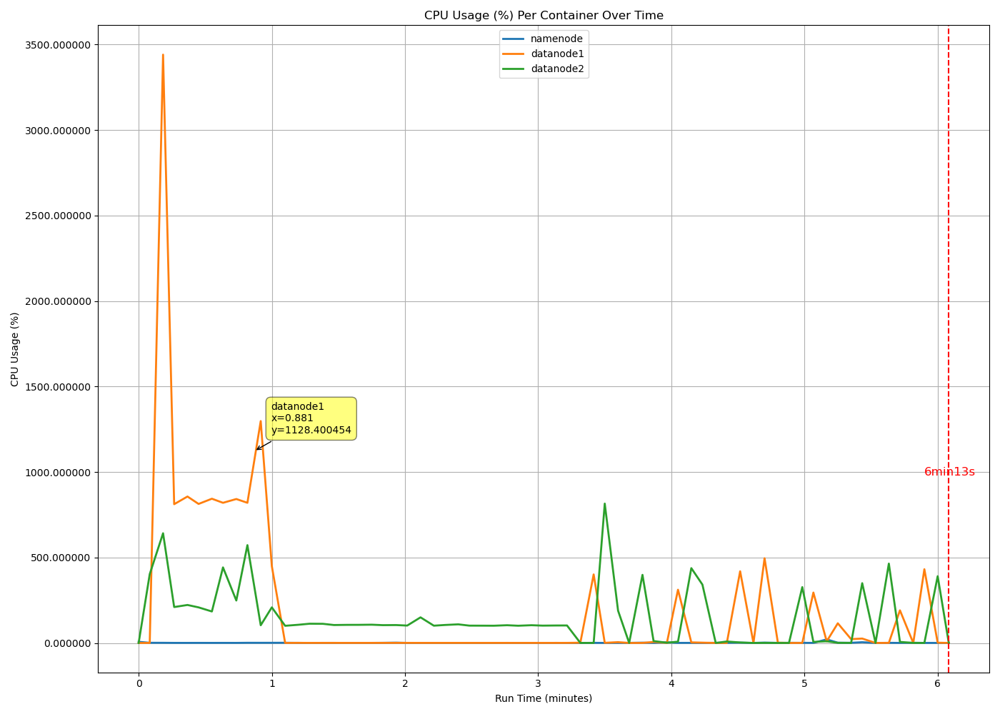
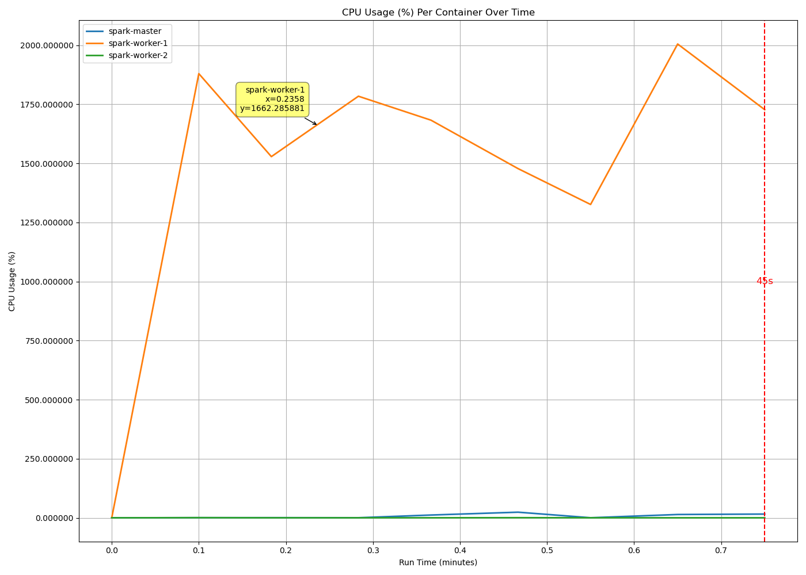

# DaSE-MapReduce与Spark的迭代性能对比————以PageRank处理Wikipedia Clickstream数据集为例

2024秋季学习DaSE大规模数据处理课程小组作业

## 项目分工
|成员|工作内容|工作量|
|--|--|--|
|杨舜  |实验设计，实验环境搭建，实验收集数据|25%|
|徐沛楹|实验设计，实验代码编写，结果验证|25%|
|姚嘉和|实验设计，环境测试，数据可视化|25%|
|薛沁晨|实验设计，实验报告整理，ppt制作|25%|

## 研究目的

本测试旨在通过对比Spark和MapReduce在不同条件下执行Pagerank的性能，揭示两者在处理大规模数据时的效率差异。

1. HDFS（Hadoop Distributed File System）
    - NameNode：HDFS的主节点，负责管理文件系统的命名空间和控制对文件的访问。在集群中只有一个NameNode，它存储了文件系统的元数据和所有文件、目录的树状结构。
    - DataNode：HDFS的工作节点，负责存储实际的数据块。在设计方案中，我们有两个DataNode，它们会存储文件数据块，并定期向NameNode报告自己的状态和所存储的数据块。

2. MapReduce
    - MapReduce的两个主要组件是Map任务和Reduce任务

3. Spark
    - Spark Master节点：Spark集群的管理和控制节点，Master节点运行Spark的Master进程，分配资源给各种Spark作业，并跟踪作业的执行进度。
    - Spark Worker节点: Spark的工作节点，负责执行Spark作业中的任务。每个Worker节点运行一个Worker进程，Worker节点负责执行实际的任务，如Map、Reduce、Aggregate等，并返回结果给Master。

## 研究方法

### 实验设计

本测试旨在通过对比Spark和MapReduce在不同条件下执行Pagerank的性能，揭示两者在处理大规模数据时的效率差异。实验内容包括：

1. 在3节点(1个namenode2个datanode/1个master2个worker)下不同数据量下spark和mapreduce对于迭代算法pagerank的执行性能对比
    
    固定节点数量来测试不同数据两下的两个结构的性能对比
    
    6个月，9个月，12，15，18

2. 对于12个月的数据量下对比spark系统部署不同数量的节点后得到的pagerank执行性能对比
    
    固定数据量来测试不同节点为spark带来的性能提升
    
    1个节点，2个节点，3个节点

### 数据集介绍

#### 1. Wikipedia Clickstream 介绍

Wikipedia Clickstream是指用户在Wikipedia网站上浏览条目的路径和顺序，通常用于分析用户如何通过点击不同的页面来获取信息。

Wikipedia Clickstream通过收集用户访问Wikipedia页面时的点击数据，包括从一个页面跳转到另一个页面的顺序，来生成用户的点击流。每个页面之间的跳转都可以被视为一个链接，这些链接构成了Wikipedia条目之间的连接网络。Clickstream数据通常会包括点击来源、目标页面以及每次点击的时间戳。通过对这些数据进行统计分析，可以追踪用户在Wikipedia上的导航路径，理解用户对信息的需求和兴趣。

#### 2. 包含的内容

数据集中，按照月份包含了很多语言的维基百科的跳转数据，为了综合不同月的数据，我们从中选择了中文的数据，时间从2023年4月至2024年11月为止，后续我们还从中挑选了6、9、12、15、18个月的数据，用于测试spark mapreduce在不同数据量下的表现。

数据通常存储为以页面对（源页面和目标页面）为单位的交互数据，这些页面对根据点击频次进行排序，以便进行进一步的分析。下面是一个典型的数据，分别是指向页面、被指向的页面，类型，以及点击次数。

#### 3. 数据清洗

- 删除所有来自 external 的记录
- 删除无效来源记录去除来源是 "other-empty" 或 "other-internal" 的记录
- 删除无效目标页面 如果目标页面（curr_page）是某些系统页面（如帮助页面、文件页面等），可以排除
- 删除来源和目标页面相同的记录
- 重置索引（方便后续操作）

### PageRank设计

PageRank的计算公式如下：

$
PR(A) = \frac{1-d}{N} + d \sum_{i \in M(A)} \frac{PR(i)}{L(i)}
$

- **PR(A)**：网页A的PageRank值
- **d**：阻尼因子（通常取值为0.85）
- **N**：网页总数
- **M(A)**：指向网页A的所有网页集合（即A的入链集合）
- **L(i)**：网页i的出链数（即网页i指向其他网页的数量）

这个公式的含义是：网页A的PageRank值等于一个基准值（\(\frac{1-d}{N}\)），加上从所有指向网页A的网页的PageRank值按其出链数进行平均的贡献，乘以一个阻尼因子d。

由于PageRank的计算涉及到网页之间的相互依赖，因此无法直接计算，需要通过迭代的方式来求解。一般的计算过程如下：

1. **初始化**：为所有网页分配一个初始的PageRank值（通常为相同值）。
2. **迭代**：根据上述公式更新每个网页的PageRank值，直到所有网页的PageRank值收敛（即变化非常小）为止。

在本次项目中，我们分别实现了pagerank算法的mapreduce实现以及spark实现。其中，mapreduce实现由java完成，最终打包为jar后提交到hadoop上执行；spark实现则由python完成，提交至pyspark运行。

## 实验环境

- docker v24.0.7
- docker-compose v2.31.0
- hadoop 3.3.6
- spark 3.5.3

### 宿主机环境
|||
|--|--|
|CPU|Intel(R) Xeon(R) Gold 6240R|
|socket|2|
|physical cores|24|
|DRAM|384G|

### docker环境
|||
|--|--|
|Mem Limit|16G|

## 研究结果

### Pagerank结果

经过10轮pagerank的迭代，我们得到的top 10被点击的页面如下所示，它们的pagerank值比较接近

| Rank | Page                | PageRank |
| ---- | ------------------- | -------- |
| 1    | YouTube             | 8.2022   |
| 2    | Hololive_production | 7.1525   |
| 3    | MakerVille          | 6.8477   |
| 4    | Super_Junior        | 6.4691   |
| 5    | Moving              | 6.3733   |
| 6    | AKB48               | 6.0895   |
| 7    | Instagram           | 6.0216   |
| 8    | TWICE               | 6.0041   |
| 9    | SNH48               | 5.9900   |
| 10   | Netflix             | 5.9686   |

可以看出，即使是在中文维基上，大多数人喜欢浏览的居然是娱乐页面。

这张图是 **PageRank值的分布直方图**，可以看出：

1. **横轴 (X轴)**：代表 **PageRank Value**（PageRank值），数值从0开始，向右逐渐增大，最大值接近8。
2. **纵轴 (Y轴)**：代表 **Frequency**（频率），即具有特定PageRank值的页面数量。
3. **数据分布**：
   - 大部分PageRank值集中在较小的区间（接近0附近），表明PageRank值较低的页面数量占据了主导地位。
   - PageRank值较高的页面较少，频率逐渐下降，呈现 **长尾分布** 的趋势。
4. **具体形态**：
   - 左侧峰值很高，表示绝大部分页面的PageRank值在0到1之间。
   - 随着PageRank值的增加，频率迅速下降，右侧几乎呈现平滑接近零的趋势。
   - 分布的尾部有一些PageRank值较高的页面，但数量非常稀少。

​该图表反映了PageRank值的典型 **幂律分布** 特性，说明在网络结构中，少数页面的PageRank值非常高，而大多数页面的PageRank值较低。这种现象通常符合互联网网页或社交网络中的链接结构规律。

同时，我们也做了社区检测，通过页面之间的链接关系，使用社区检测算法（如 Louvain 算法）找到内容相关性高的页面群。其中找出了50个社区，下面是两个典型的社区，一个是娱乐相关的，一个是计算机相关的：

### 性能结果对比

mapreduce在处理不同数据量的pagerank执行效率

| type |  time   | first iter(map + shuffle + merge + reduce)|
| --   |   --    | -- |
|mr  6 | 4min34s | (1min43s)24s + 13s + 4s + 1min3s  |
|mr  9 | 5min22s | (2min29s)38s + 18s + 5s + 1min35s |
|mr 12 | 5min37s | (2min50s)43s + 13s + 3s + 1min53s |
|mr 15 | 6min13s | (3min26s)50s + 34s + 4s + 2min10s |
|mr 18 | 6min49s | (3min59s)57s + 53s + 4s + 3min25s |

spark在处理不同数据量的pagerank执行效率

|type|time|
| -- | -- |
|spark  6  | 33s |
|spark  9  | 42s |
|spark  12 | 45s |
|spark  15 | 54s |
|spark  18 | 65s |

spark在不同节点数量下的pagerank执行效率

|type|time|
| -- | -- |
|spark  node1 | 60s |
|spark  node2 | 54s |
|spark  node3 | 50s |
|spark  node3 | 47s |
|spark  node5 | 45s |
|spark  node6 | 40s |

### 执行性能监测

CPU监测

Mem检测

IO监测

## 实验总结

Spark在执行Pagerank时，随着数据量的增加和节点数量的增多，其性能优势逐渐显现，特别是在处理大规模数据集时，Spark展现出了更高的效率和速度。

在固定节点数和不同数据量的测试中，Spark 显示出比 MapReduce 更快的处理速度，特别是在处理大规模数据集时，其内存计算的优势尤为突出。当数据量固定而节点数量变化时，Spark 能够有效利用增加的节点资源，提高任务执行效率，展示了良好的水平扩展能力，而 MapReduce 在节点增加时性能提升有限。